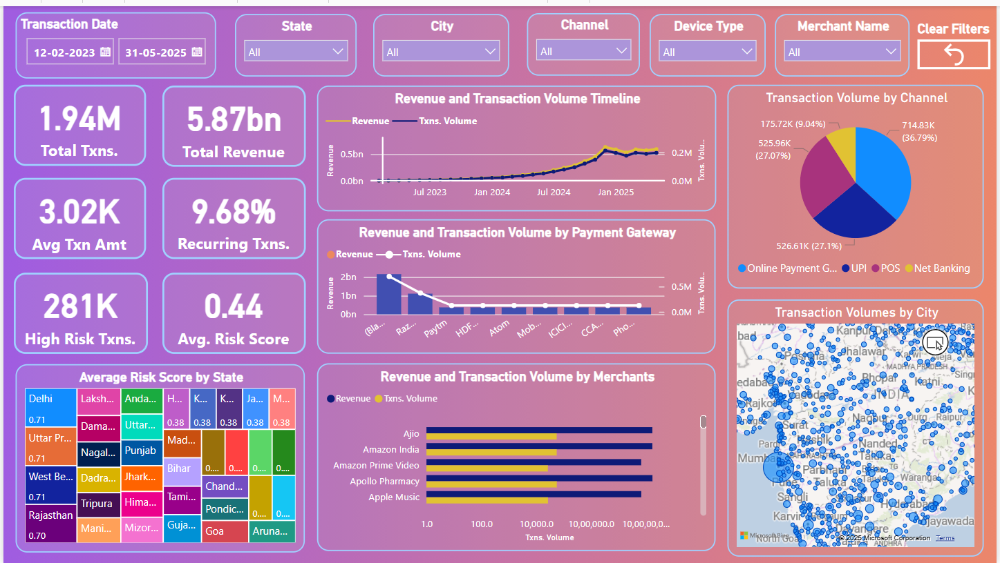

# Real-Time Financial Transactions Data Pipeline

> A streaming data pipeline on Google Cloud Platform for ingesting, transforming, and analyzing financial transaction events in real time. The project uses Compute Engine, Cloud Pub/Sub, Dataflow, BigQuery, Cloud Functions, and Power BI for end‑to‑end data processing and visualization.

---

## 🏗️ Architecture Overview

1. **Dummy Data Generation & Pub/Sub Publishing**  
   - Python scripts (`dim_customer.py`, `dim_account.py`, `fact_transactions.py`) running on Compute Engine generate synthetic JSON messages for customers, accounts, and transactions, and publish them directly to the respective Cloud Pub/Sub topics.

2. **Static Dimensions via CSV → GCS → BigQuery**  
   - Other dimension tables (`dim_device_type`, `dim_transaction_channel`, `dim_card_provider`, etc.) are maintained as CSV files.  
   - CSVs are uploaded to a GCS bucket; a Cloud Function is triggered on upload to load those dimension records into BigQuery.

3. **Real‑Time Processing**  
   - A Cloud Dataflow (Apache Beam) pipeline (`pipeline.py`) subscribes to the customer, account, and transaction Pub/Sub topics.  
   - It parses incoming JSON, performs card tokenization and PAN masking via Cloud KMS–backed format‑preserving encryption, and writes both valid transaction records and error records to BigQuery streaming tables.

4. **Data Warehouse & Modeling**  
   - BigQuery hosts fact and dimension tables following a star schema for analytical queries.

5. **Visualization**  
   - Power BI connects to BigQuery to render an interactive dashboard for transaction monitoring, revenue analytics, and risk scoring.

---

## 🧱 Data Model

The warehouse follows a star schema:

- **Fact Table**  
  - `financial_transactions`: one row per transaction, with foreign keys to all dimensions and measures such as `amount`, `tax_amount`, `discount_amount`, `total_amount`, and `risk_score`.

- **Dimension Tables**  
  - `dim_customer`: customer master data (name, email, phone, signup date, status, segment, address).  
  - `dim_account`: account details (type, open/close dates, status).  
  - `dim_device_type`: device types (e.g., Mobile, Desktop).  
  - `dim_transaction_channel`: channels (Online Payment Gateway, UPI, POS, Net Banking).  
  - `dim_card_provider`: card networks (Visa, MasterCard, etc.).  
  - `dim_payment_gateway`: payment gateway vendors (Razorpay, Paytm, etc.).  
  - `dim_mcc_codes`: merchant category codes and descriptions.  
  - `date_dim`: calendar attributes (date, year, quarter, month, day, day_of_week).  
  - `time_dim`: time attributes (hour, minute, second, period).

---

## 🔧 Code Highlights

- **Dummy Data Scripts**  
  - Generate synthetic JSON messages for dim_customer,dim_account and fact_transactions in Python and publish them directly to the respective Pub/Sub topics.

- **Dataflow Pipeline** (`dataflow_pipeline/`)
  - `pipeline.py`  
    - Subscribes to the customer, account, and transaction topics.  
    - Parses and validates JSON messages.  
    - Leverages Cloud KMS–backed format‑preserving encryption to tokenize card data and mask PANs
    - Streams both successful transaction records and error entries into BigQuery via streaming tables.

- **Cloud Functions** (`update_dimension_function/`)  
  - Trigger: GCS bucket on CSV upload.
  - `main.py`
    - Loads each static dimension CSV data into BigQuery tables.

- **BigQuery DDL & DML**
  - DDL scripts to create fact and dimension tables with proper schemas and clustering/partitioning.  

---

> _All code is implemented in Python 3.x, using the Google Cloud SDK, Apache Beam SDK, and the BigQuery client library._

---

## 📊 Power BI Dashboard

An interactive Power BI report connected live to BigQuery, featuring:

- **Stat Cards**  
  - Total Txns. | Total Revenue | Avg Txn Amt | Recurring Txns %  
  - High‑Risk Txns | Avg. Risk Score

- **Charts & Maps**  
  - Revenue & Transaction Volume Timeline  
  - Volume by Payment Gateway & Channel  
  - Revenue vs. Volume by Merchant  
  - Average Risk Score by State (tree map)  
  - Transaction Volumes by City (map)

- **Filters**  
  - Date Range | State | City | Channel | Device Type | Merchant Name

[Dashboard Interactive Video Demo](https://drive.google.com/file/d/1-CKV1r51si8PA14XsbtP8WbZi8bHSeqh/view?usp=sharing)
